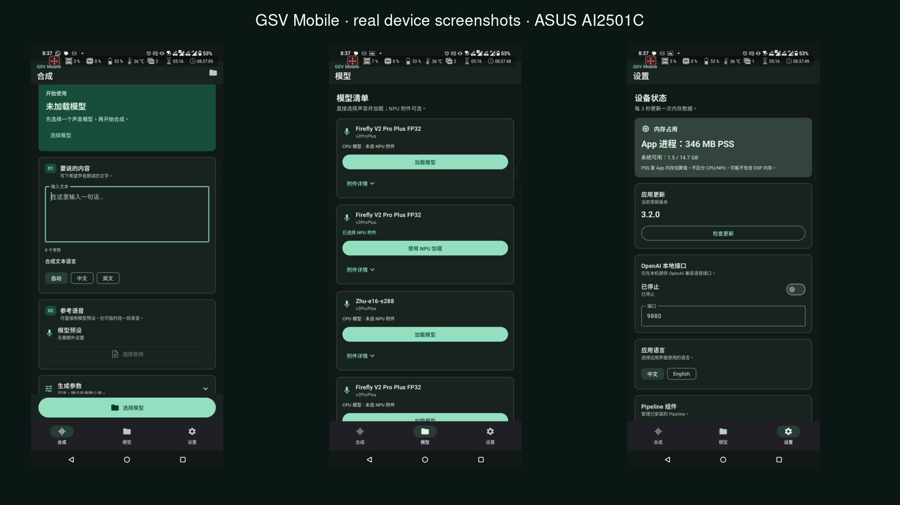

# GSV Mobile v3.2.0

<p align="center">
  
</p>

<p align="center"><strong>GPT-SoVITS 最好的手机优化版本。</strong><br/>
GPT-SoVITS V2 Pro Plus 与 V4，一次转换，Android 本地合成。</p>

<p align="center">
  <a href="#功能">功能</a> ·
  <a href="#android-使用">快速开始</a> ·
  <a href="#同句性能对比">性能对比</a>
</p>

[English README](README.md)

GSV Mobile 可在 Android 本地转换并运行 [GPT-SoVITS](https://github.com/RVC-Boss/GPT-SoVITS) V2 Pro Plus 与 V4 音色。精确的 FP32 CPU 执行是正确性基准；QNN/NPU 目前仅用于工程预览，尚未完成匹配设备验收，也不是 v3 的受支持功能。

本项目是独立的 Android 部署实现，并非 GPT-SoVITS 官方应用，也不隶属于上游维护者。

### 真机截图

以下截图直接拍摄于正在运行 GSV Mobile 的 ASUS AI2501C，并非模拟器：



## 功能

- 支持 GPT-SoVITS V2 Pro Plus 和 V4 模型转换
- 使用不量化、不改变数据类型的 FP32 权重
- 中英文 Android 界面，支持跟随系统语言及应用内切换
- 支持请求级参考音频，同时保留转换时的预置参考音频
- 共享并持久化 V2PP/V4 流水线组件
- 自动扫描 `/sdcard/models/gs`，也支持 Android 系统文件选择器
- 基于 Storage Access Framework URI 的持久化模型列表
- Compose 合成界面、采样参数和音频播放
- OpenAI 兼容的本地 `POST /v1/audio/speech` 接口
- 默认生成仅含模型的包，也可生成包含流水线资源的自包含包

普通 UTF-8 `.gsvm` 包是 FP32 CPU 正确性产物。`.qnn.gsvm` 文件属于实验性 QNN 流水线和音色附件，在发布匹配设备验收结果前请勿依赖。

## 环境要求

### Android

- Android 8.0（API 26）或更高版本
- 64 位 Android 设备
- V2 Pro Plus：最低仅需 8 GB 物理内存（已验证）
- 大型 V4 任务：建议准备约 8--12 GB 可用进程内存

### 转换主机

- 与本目录并列检出的 GPT-SoVITS 源码仓库
- 上游 Python 环境和预训练模型
- 足够的内存和磁盘空间用于 FP32 图导出

目录结构应类似：

```text
GPT-SoVITS/
├── android/       # 本项目
├── GPT_SoVITS/
├── GPT_weights_v2ProPlus/
└── SoVITS_weights_v2ProPlus/
```

## 构建 Android 应用

在 `local.properties` 中设置 Android SDK：

```properties
sdk.dir=/path/to/Android/Sdk
```

构建调试 APK：

```bash
./gradlew :app:assembleDebug
```

APK 输出于 `app/build/outputs/apk/debug/app-debug.apk`。如需设备验收用的 arm64 工程 APK：

```bash
./gradlew -PacceptanceAbi=arm64-v8a :app:assembleRelease
```

生成的 `app-release-unsigned.apk` 未签名，分发前必须使用正式 Android 签名密钥签名。

## 命令行转换

生成仅含模型的包：

```bash
../gpt/bin/python tools/build_android_cpu_pipeline.py \
  --gpt ../GPT_weights_v2ProPlus/voice.ckpt \
  --sovits ../SoVITS_weights_v2ProPlus/voice.pth \
  --reference ../reference.wav \
  --prompt '参考音频对应文本' \
  --name voice \
  --work build/voice \
  --model-output converted_models/voice-model.gsvm \
  --upstream ..
```

将 `--model-output` 改为 `--output converted_models/voice.gsvm` 可生成自包含包。

## Android 使用

1. 首次运行时安装一个或两个流水线组件。
2. 将 `.gsvm` 包放入 `/sdcard/models/gs`。
3. 在可折叠模型列表中选择模型。
4. 输入文本，调整合成参数，生成并播放 WAV。

旧版 `.gsvm` 不受支持，请使用 Web 转换器重新生成。模型、转换产物、临时文件和测试输出均必须位于 `/sdcard/models/gs`，不得放在 `/sdcard/` 根目录。

开发设备示例：

```bash
adb shell mkdir -p /sdcard/models/gs
adb push converted_models/voice-model.gsvm /sdcard/models/gs/
```

然后打开“模型”并选择“扫描文件夹”。添加音色模型仍使用 Storage Access Framework，不需要授予广泛存储权限。

CPU 分段耗时和模拟器线程测试记录见 [CPU 性能基线](docs/CPU_PERFORMANCE.md)。
Snapdragon 8 Elite 的 QNN 实机执行核对、短句复用缓存与性能数据见 [NPU 性能记录](docs/NPU_PERFORMANCE.md)。设置页可手动检查 GitHub Release 更新；启动时也会后台检查新版本，原站不可达则尝试镜像。

## 本地 OpenAI API

在 Android“设置”中启用本地 API，默认监听设备回环地址的 `9880` 端口：

```bash
adb forward tcp:9880 tcp:9880
curl http://127.0.0.1:9880/v1/audio/speech \
  -H 'Content-Type: application/json' \
  -d '{"model":"gpt-sovits-local","voice":"loaded-artifact","input":"这是一段本地语音合成测试。","response_format":"wav","speed":1.0}' \
  --output tts.wav
```

支持 `temperature`、`top_p`、`top_k`、`repetition_penalty`、`sample_steps`、`seed` 和 `language` 扩展字段，目前仅支持 WAV。也可通过 `reference_audio`（不超过 50 MiB 的 Base64 音频）、`reference_text` 和 `reference_language`（`auto`、`zh`、`en`）临时覆盖参考音频；覆盖仅对当前请求生效。

## 包格式与运行时契约

Android 层只是轻量执行宿主。转换工具负责检查点版本、计算图、前端资源、兼容性元数据和权重校验。每个部署包提供一个稳定操作：

```text
UTF-8 文本 + 合成选项 -> 单声道 PCM16 音频
```

仅模型包声明 `artifact_role=model`，共享流水线声明 `artifact_role=pipeline`。应用在组合前校验清单和 SHA-256；当前转换器生成的包使用 `reference_input_version=1`。
新转换的模型会在清单中显示 `product_version=v3.2.0+0`；只有转换产物或转换逻辑变化时才递增 `+N`。

### V100 速度参考

Tesla V100-SXM2 16 GB 上使用上游 V2 Pro Plus Firefly 模型（CUDA FP16、seed 1234、文本“你好今天我们一起测试语音合成。”、32 kHz）实测：模型加载 **4.66 秒**，合成 **4.84 秒**，输出 105,600 采样点。该数值只是桌面 GPU 参考，不代表 Android 性能；测试使用 `ex146.wav`，省略参考文本以使用音频预设。

### 同句性能对比

三行使用同一句 `你好今天我们一起测试语音合成。` 和 seed 1234。Android 数据来自 ASUS
AI2501C（Snapdragon 8 Elite / SM8750），测试时应用处于空闲状态。

| 后端 | 设备 | 模型/会话加载 | 合成或首次请求 | 输出 |
| --- | --- | ---: | ---: | ---: |
| CUDA FP16 | Tesla V100-SXM2 16 GB | 4.66 秒 | 加载后 4.84 秒 | 105,600 samples |
| CPU FP32 staged | ASUS SM8750 | BERT 4.66 秒 + 声学模块 5.41 秒（首次请求内） | 首次请求 26.98 秒 | 163,840 samples |
| QNN HTP FP16 | ASUS SM8750 / V79 | 常用图在加载时预热；参考图按需加载 | 首次请求 21.34 秒 | 193,280 samples |

QNN 行是工程测试数据，不代表已发布的兼容性承诺；本次预设路径已确认关闭 CPU
fallback，临时参考音频仍需单独完成验收。

## Qualcomm QNN / HTP（工程预览）

QNN/HTP 仅用于转换器和硬件验证，CPU 包才是受支持的 v3 路径。允许的目标平台只有：

| 目标 | SoC | HTP |
| --- | --- | --- |
| `snapdragon_8_gen_3` | SM8650 | V75 |
| `snapdragon_8_elite` | SM8750 | V79 |
| `snapdragon_8_elite_gen_5` | SM8850 | V81 |

每个 QNN 包必须携带匹配 QAIRT SDK 生成的精确 `target_soc`、`target_soc_family`、`htp_arch`、`qairt_version` 和 `backend_artifact`，运行时不会推断架构，也不会跨代复用 context binary。QNN FP16 是独立的浮点加速产物，不能替代 FP32 CPU TorchScript 产物；发布前必须在对应实体设备上完成 CPU 对比、QNN-only 执行、非静音 PCM 检查和可听性验收。完整的编译与验收命令请参阅[英文文档](README.md#qualcomm-qnn--htp-engineering-preview)。

## 质量策略

- CPU 正确性包使用原始 FP32，不量化、不转 FP16、不剪枝、不改写权重
- QNN FP16 context 是独立加速产物，必须与 CPU 结果对比验证
- 不为节省内存或提速减少 V4 CFM 步数
- 不使用会改变 PCM 输出的算子替换
- 内存优化只能调整组件驻留和调度
- CPU 推理始终是部署正确性基准

模型质量取决于源检查点和参考条件；转换无法修复训练不佳的音色模型所产生的发音或呼吸瑕疵。

## 上游与第三方

本项目基于 [RVC-Boss/GPT-SoVITS](https://github.com/RVC-Boss/GPT-SoVITS)，上游项目采用 MIT License。检查点、预训练权重、Android 库和 Python 依赖可能有各自的许可或使用限制，重新分发 APK、转换模型或托管转换服务前请自行审查。

## 许可证

本目录中的 GSV Mobile 源代码采用 [GNU General Public License v3.0](LICENSE)。该许可证不重新授权 GPT-SoVITS、第三方依赖、预训练模型或用户提供的检查点。
